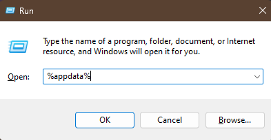
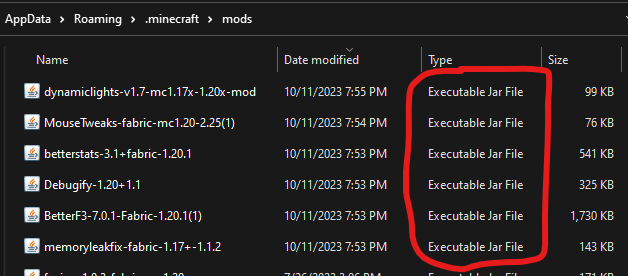

# How to Update Mods for 1.20.1
***Updated: October 7th, 2023***

## Part 1 - Installing Fabric 1.20.1
### 1. Locate the file `fabric-installer-0.11.2.exe` and run it.
### 2. Make sure you have `Minecraft Version 1.20.1`, `Loader Version 0.14.23`, and `Create profile` selected. *(Shown Below)*

### 1. After, click `Install` and then `Ok` once it's finished.

## Part 2 - Installing Mods
### 1. Press `WIN + R` on your keyboard, type in `%appdata%` and then press `OK`.
   
### 2. Go into the folder named `.minecraft` and find the folder called `mods`.
  - If there is not folder called `mods`, create a folder by pressing `right click` on your mouse over an empty area and select `New > Folder`. After this, name the folder `mods`.
### 3. Drag all of the mods in the `clientmods` folder into the `mods` folder.
  - Here you should see files with the `Type` of `Executable Jar File`. If you see a folder named `mods` then you did it wrong.
    

## Part 3 - Opening Minecraft
### 1. Launch the Minecraft Launcher and make sure you have `fabric-loader-1.20.1` set as the selected installation.

# ModUpdates
